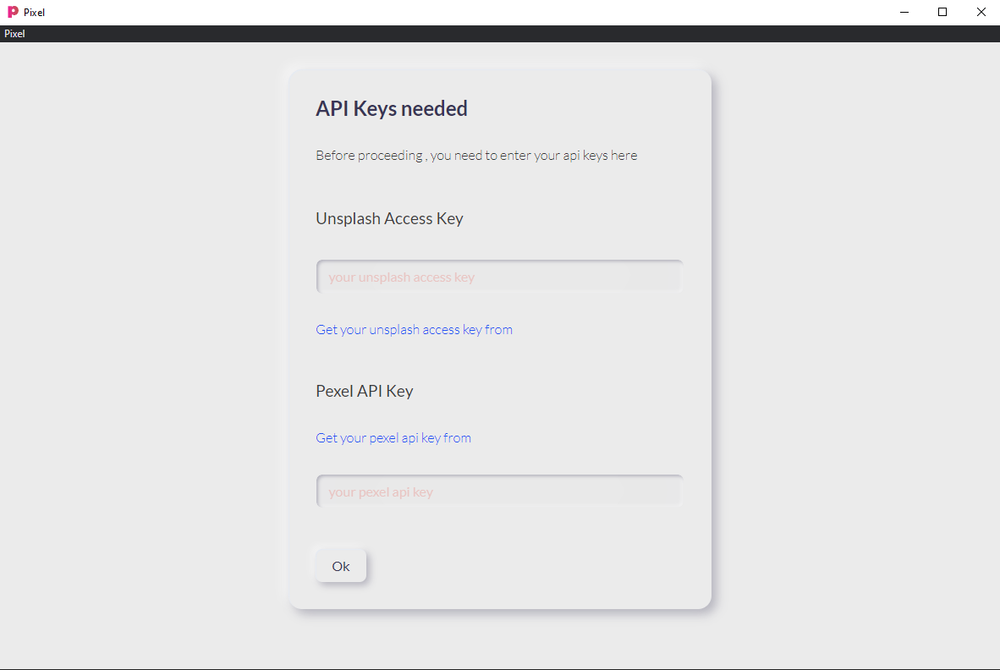

# Pixel

Pixel is GUI Desktop application for bulk downloading images from Pexel and Unsplash.

Pixel can download photos from multiple categories at the same time from both Pexel and Unsplash simultaneously . 
It can also download images from Pexel and Unsplash Seperately . 


Unsplash as they say - are The internet’s source of freely usable images. Powered by creators everywhere. Similarly Pexel is the best free stock photos & videos shared by talented creators.

## Usage

**For Windows** - 

Software Exe is provided under "dist" folder , download and it and you are ready to go.

**For Mac and Linux** - 

Precompiled files are coming soon . However , you can download this project and run it in your machine directly.

## User - Prerequisites

User need to enter there Pexel API Key and Unsplash access key to run this software.

You can get these from here :

* [Pexel API KEY](https://www.pexels.com/api/?locale=en-US) 
* [Unsplash Access Key](https://unsplash.com/developers) 


## Getting Started 

1. **Search Term**  - Your search query eg - ***Mountain***  to get the images of Montains . You can also supply multiple search queries

      at ones by comma seperations eg:  ***Mountains,Grocery***

2. **Quantity** - Amount of images you want to download.

3. **Platform** - Select from which website you want the result :  Pexel , Unsplash or from both.


## Steps Available  After Platform selection

### For Pexel :

Select platform >  Select Pexel image size > Select folder to save image

### For Unsplash :

Select platform > Select Featured Status > Select Orientation > Select folder to save image

### For Pexel/Unsplash Combine :

Select platform > Select Pexel image size > Select Featured Status > Select Orientation > Select folder to save image

__________________


## Project Setup and Getting Started

These instructions will get you a copy of the project up and running on your local machine for development purposes. 

### Prerequisites

This project is based on  [ElectronJS](https://www.electronjs.org/)  and  [Nodejs](https://nodejs.org/en/)

Make sure you have Node.js installed.

Visit - [Node JS](https://github.com/nodejs/node)

### Installing

1. Create a folder to hold your installation: eg : mkdir Pixel
2. Clone the repository : 

```
$ git clone https://github.com/singhvbv/Pixel.git

```
3. Enter folder: cd Pixel
4. Install dependencies: npm install

```
> npm install
```
-- Starting project  

```
> npm start
```

-- Starting with Nodemon  

```
> npm run serve
```

-- Creating  Distribution  

```
> npm run dist
```
-- Creating  Mac and Windows Distribution  

```
> npm run dist-all
```

## Some Screenshots :





## Contributing

Please read [CONTRIBUTING.md](https://github.com/singhvbv/Pixel/blob/master/CONTRIBUTING.md) for details on our code of conduct, and the process for submitting pull requests to us.


## Authors

* **Vaibhav Singh** -  - [Vaibhav Singh](https://singhvbv.github.io/)
Github -  - [Profile](https://github.com/singhvbv)

See also the list of [contributors](https://github.com/singhvbv/pixel/contributors) who participated in this project.

## License

This project is licensed under the MIT License - see the [LICENSE.md](LICENSE.md) file for details

